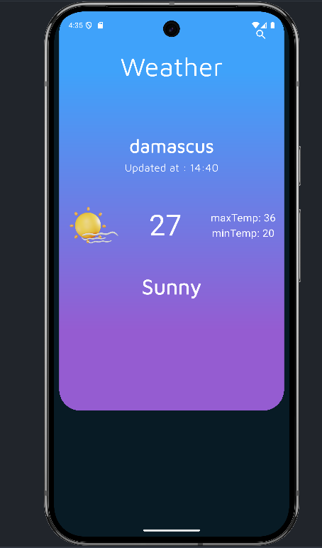

### Weather App (Flutter)

Interactive weather application built with Flutter. Search any city and view current conditions with temperature, min/max, last updated time, and a matching illustration. State is managed via `provider`, data fetched with `http` from WeatherAPI.


### Features
- **City search**: Enter a city and fetch current day forecast.
- **Live data**: Uses WeatherAPI `forecast.json` endpoint.
- **Clean UI**: Gradient cards, custom fonts, weather illustrations.
- **State management**: `provider` for reactive UI updates.

### Tech Stack
- **Flutter** (Material)
- **Packages**: `provider`, `http`, `intl`

### Project Structure
- `lib/main.dart`: App bootstrap, theme, top-level `ChangeNotifierProvider`.
- `lib/pages/home_page.dart`: Home UI; shows weather or an empty state and search button.
- `lib/pages/search_page.dart`: City input; triggers fetch and updates provider.
- `lib/models/weather_model.dart`: Model + JSON parsing and helpers (icon + theme color).
- `lib/providers/weather_provider.dart`: `ChangeNotifier` holding `WeatherModel` and `cityName`.
- `lib/services/weather_services.dart`: API client using `http`.
- `assets/images/`: Weather icons used in UI.
- `assets/fonts/`: Custom fonts (`Hubballi`, `MavenPro`).

### How It Works
1. From the home screen, tap the search icon to open the search page.
2. Enter a city name; the app calls WeatherAPI:
   - `GET /v1/forecast.json?key=<API_KEY>&q=<CITY>&days=7`
3. Response is parsed into `WeatherModel` and stored in `WeatherProvider`.
4. The home screen listens to provider and updates instantly.

### Prerequisites
- Flutter SDK installed and on PATH (see Flutter docs).
- A WeatherAPI key (free tier works).

### Setup & Run
1. Install dependencies:
```bash
flutter pub get
```
2. Add your WeatherAPI key:
   - Open `lib/services/weather_services.dart` and set `apiKey` to your key.
   - Example: `String apiKey = 'YOUR_KEY_HERE';`
   - Note: For production, consider passing secrets via `--dart-define` or using an env package.
3. Run the app on a device/emulator:
```bash
flutter run
```

### Configuration
- Assets are declared in `pubspec.yaml` under `flutter.assets` (weather images) and `flutter.fonts`.
- App uses `provider` and `intl` as declared in `pubspec.yaml`.

### Known Limitations
- API key is stored in source for simplicity; prefer runtime config for real deployments.
- Minimal error handling on failed requests/invalid cities.

### Acknowledgements
- Weather data from WeatherAPI (`https://www.weatherapi.com/`).

### License
This project is provided as-is for learning/demo purposes. Add a license if you plan to distribute.
